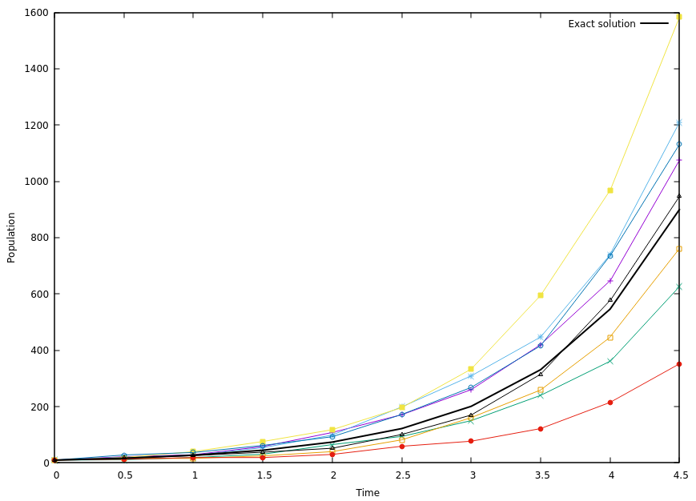

## Convergence/KineticMonteCarlo/C1

This example compares Kinetic Monte Carlo solutions with an exact solution for an electron avalanche process.
The reactions involved in the KMC model are 'e + null -> e + e + null' and 'e -> null'.

# Compilation

To compile:

```make -s -j<num_proc> OPT=HIGH DEBUG=FALSE DIM=2 program```

# Running the example

To run with MPI:

```mpirun -np <num_proc> program2d.*ex example.inputs```

The user can select between different algorithms and initial conditions in the input script. 

# Output

Output is given in the pout.* files.
The files contain data in the format

"Time" "KMC solution" "Exact solution"

The figure below shows an example when run over 8 ranks

