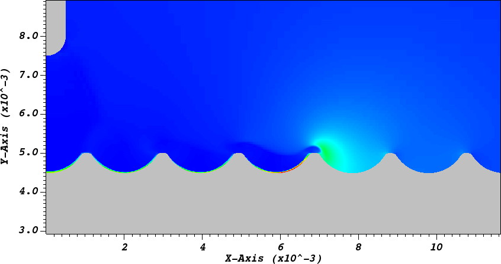

## Exec/Examples/CdrPlasma/ProfiledSurface

This example runs a Cartesian 2D model of a positive streamer over a profiled dielectric.
the input scripts and plasma chemistry are defined in

* 2D input: positive_circle2d.inputs
* Plasma chemistry: air_chemistry.json (containing reactions and initial conditions)
* Transport data: Read from the file 'transport_air.dat'

This model uses a drift-diffusion for the electrons and ions, and a Helmholtz reconstruction for the ionizing photons.
For a further explanation to the parameters in the chemistry file, see the [chombo-discharge documentation](https://chombo-discharge.github.io/chombo-discharge/Applications/CdrPlasmaModel.html#json-interface).

# Compilation

To compile:

```make -s -j<num_proc> OPT=HIGH DEBUG=FALSE DIM=2 program```

# Running the example

To run with MPI:

```mpirun -np <num_proc> program2d.*ex sprite2d.inputs```

The user can select between different algorithms and initial conditions in the input script and chemistry file. 

# Output

Output is given to HDF5 files in the plt folder.


