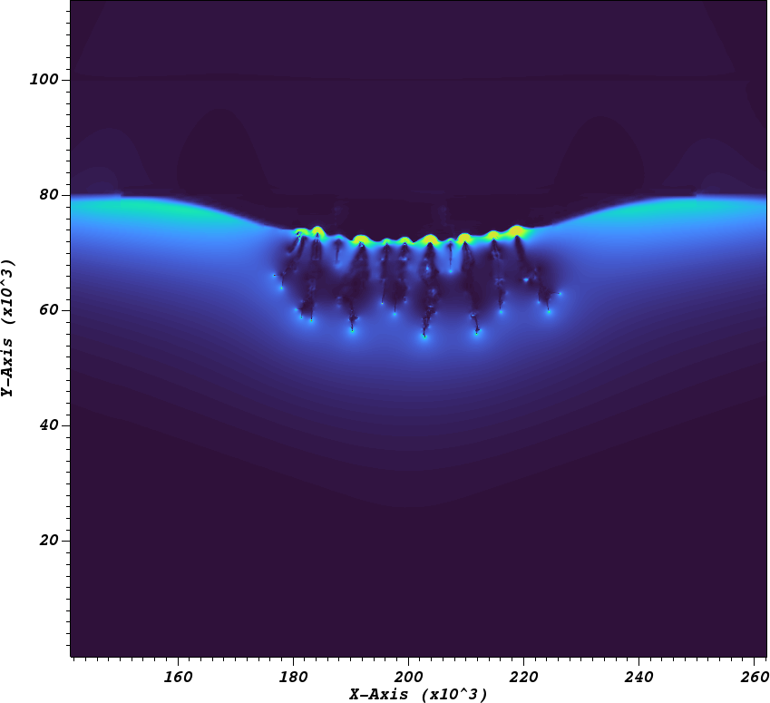

## Exec/Examples/CdrPlasma/Sprite

This example runs a Cartesian 2D model of a sprite discharge.
the input scripts and plasma chemistry are defined in

* Plasma chemistry: air_chemistry2d.json (containing reactions and initial conditions)
* 2D input: sprite2d.inputs
* Transport data: Read from the file 'bolsig_air.dat'
* Atmosphere: Density, temperature, and pressure read from ENMIS_Atmosphere.dat
* Initial conditions: Defined in tanh.dat, which defines a height profile for the background density, including the ionosphere.

This model is set up with a positive cloud charge that asymptotically decays with a specified rate.
The remaining field resembles a dipole field from the cloud/ground, which initiaties a sprite discharge at approximately 80km altitude.

This model uses a drift-diffusion for the electrons and ions, and Monte Carlo transport for the ionizing photons.
For a further explanation to the parameters in the chemistry file, see the [chombo-discharge documentation](https://chombo-discharge.github.io/chombo-discharge/Applications/CdrPlasmaModel.html#json-interface).

# Compilation

To compile:

```make -s -j<num_proc> OPT=HIGH DEBUG=FALSE DIM=2 program```

# Running the example

To run with MPI:

```mpirun -np <num_proc> program2d.*ex sprite2d.inputs```

The user can select between different algorithms and initial conditions in the input script and chemistry file. 

# Output

Output is given to HDF5 files in the plt folder.


