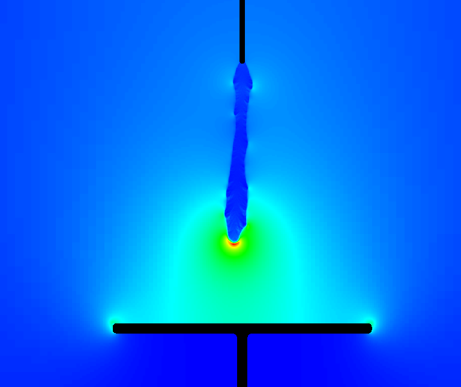
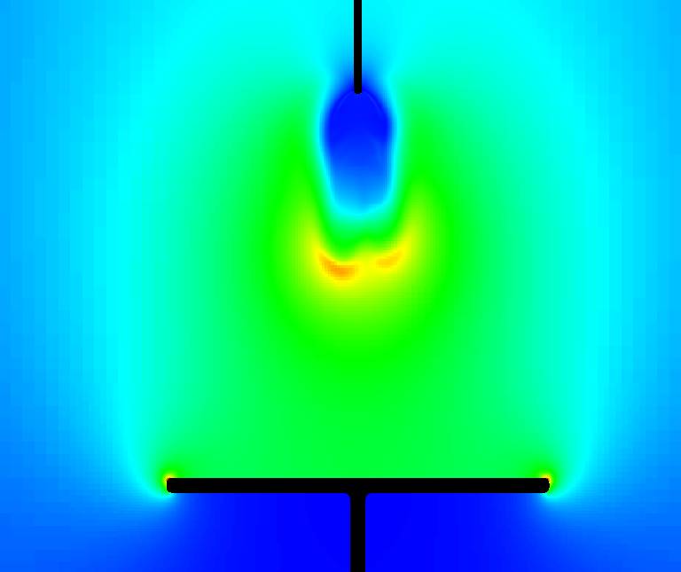

## Exec/Examples/CdrPlasma/DeterministicAir

This example runs a model 2D and 3D streamer discharges in a high-voltage vessel geometry.
The Input scripts and plasma chemistry are defined in

* Plasma chemistry: air_chemistry.json
* 2D input: positive2d.inputs and negative2d.inputs
* 3D input: positive3d.inputs and negative3d.inputs

This model uses a drift-diffusion for the electrons and ions, and Monte Carlo transport for the ionizing photons.
For a further explanation to the parameters in the chemistry file, see the [chombo-discharge documentation](https://chombo-discharge.github.io/chombo-discharge/Applications/CdrPlasmaModel.html#json-interface).

# Compilation

To compile:

```make -s -j<num_proc> OPT=HIGH DEBUG=FALSE DIM=2 program```

or in 3D

```make -s -j<num_proc> OPT=HIGH DEBUG=FALSE DIM=3 program```

# Running the example

To run with MPI:

```mpirun -np <num_proc> program2d.*ex positive2d.inputs```

or in 3D

```mpirun -np <num_proc> program3d.*ex positive3d.inputs```

The user can select between different algorithms and initial conditions in the input script and chemistry file. 

# Output

Output is given to HDF5 files in the plt folder.
Panels below show typical output for positive (top) and negative (bottom).



