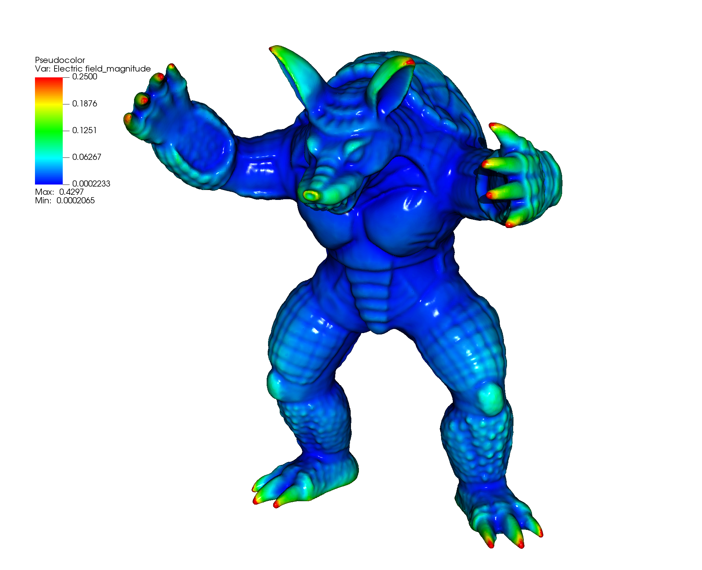

## Exec/Examples/Electrostatics/Armadillo

This example solves the Poisson equation for the electric field for a single electrode in the shape of an armadillo.
It was set up from $DISCHARGE_HOME/Physics/Electrostatics using

> ./setup.py -base_dir=Exec/Examples/Electrostatics -app_name=Armadillo -geometry=Tesselation

The file armadillo.ply was supplied externally.

This example will take several minutes to complete, and should be used with MPI.
To compile it and run it, type

> make -s -j<num_proc> OPT=HIGH DIM=3 program

To run it, type

> mpirun -np <num_proc> program3d.*.ex armadillo3d.inputs

The figure below shows the electric field magnitude on the surface (with an effective resolution of 512x512x512)

