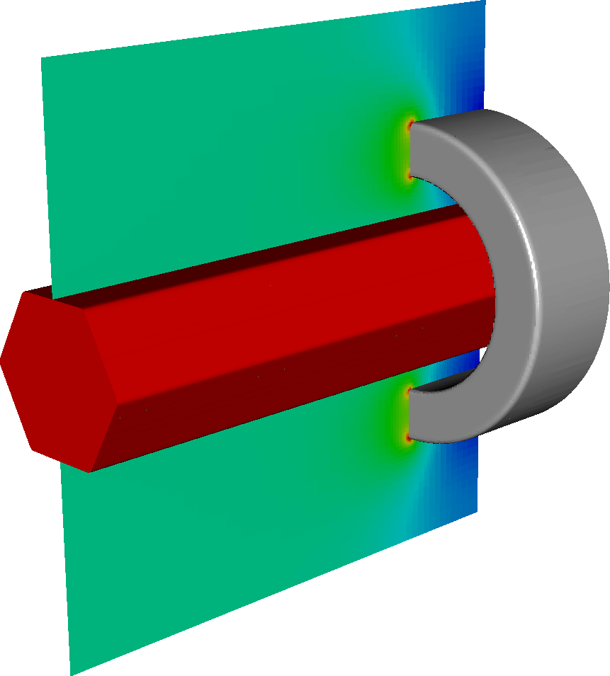

NB:This file should be reset to it's original format once OpenMP get's going.
To run hybrid OpenMPI/OpenMP, make sure the MPI ranks are not bound by specifying

mpiexec --bind-to none -n 12 -x OMP_NUM_THREADS=1 ./program3d.Linux.64.mpic++.gfortran.OPTHIGH.MPI.OPENMPCC.ex example.inputs


## Original content below
## Examples/Electrostatics/MechShaft

This example solves the Poisson equation for the electric field around a simplified mechanical bushing.
It was set up from $DISCHARGE_HOME/Physics/Electrostatics using

```./setup.py -base_dir=Examples/Electrostatics -app_name=MechShaft -dim=3 -geometry=MechanicalShaft```

This example will take a few minutes to complete, and should be used with MPI.
To compile it and run it, type

```make -s -j<num_proc> OPT=HIGH DIM=3 program```

To run it, type

```mpirun -np <num_proc> program3d.*.ex example3d.inputs```

The figure below shows the electric field magnitude sliced through the center of the domain. 


