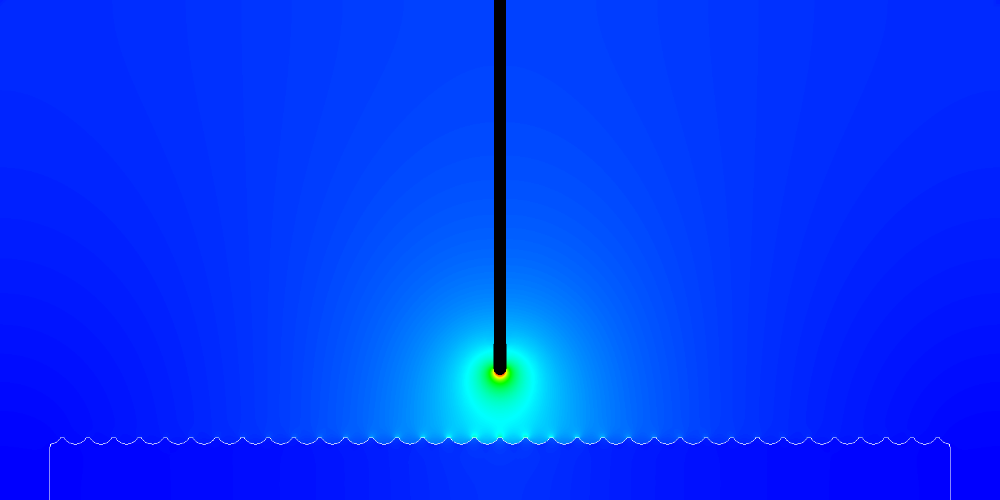
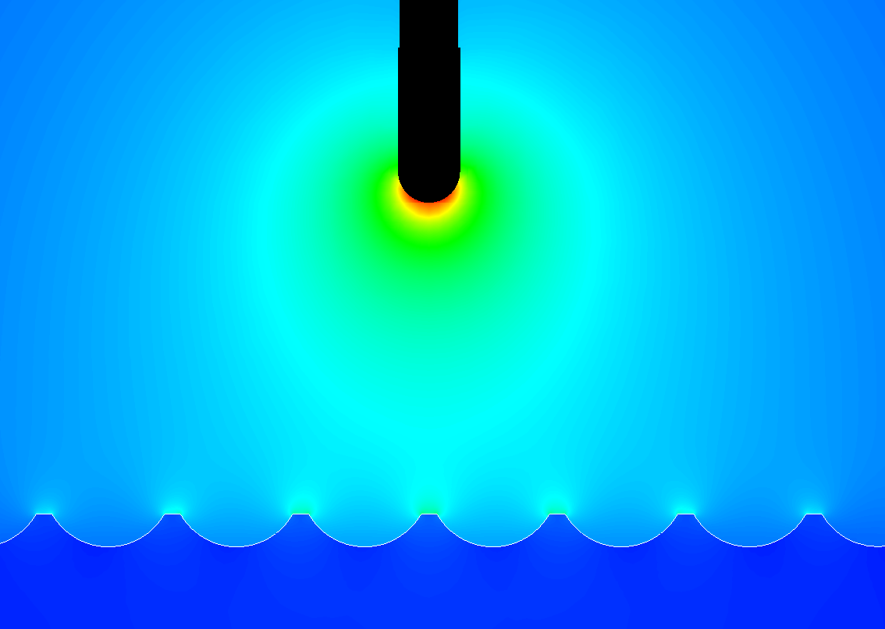

## Exec/Examples/Electrostatics/ProfiledSurface

This example solves the Poisson equation for the electric field around a simplified mechanical bushing.
It was set up from $DISCHARGE_HOME/Physics/Electrostatics using

```./setup.py -base_dir=Examples/Electrostatics -app_name=ProfiledSurface -geometry=RodPlaneProfile```

This example will take a few seconds to complete.
To compile it and run it, type

```make -s -j<num_proc> OPT=HIGH DIM=2 program```

To run it, type

```mpirun -np <num_proc> program3d.*.ex example3d.inputs```

The figure below shows the electric field magnitude sliced through the center of the domain. 


