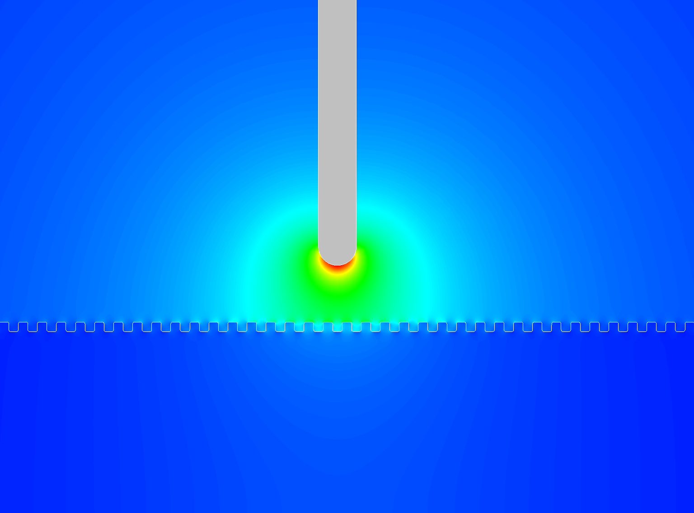
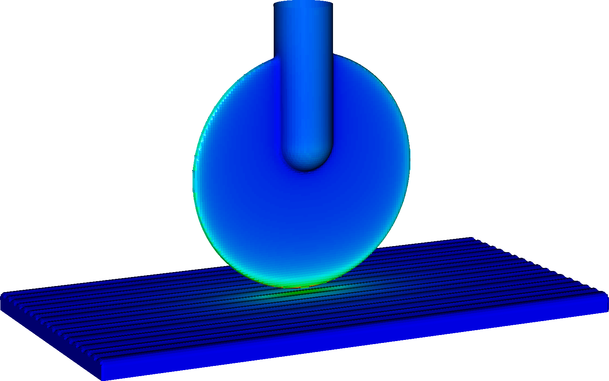

## Exec/Examples/Electrostatics/ProfiledSurface

It was set up from $DISCHARGE_HOME/Physics/Electrostatics using

```./setup.py -base_dir=Examples/Electrostatics -app_name=ProfiledSurface -geometry=DiskProfiledPlane```

To compile it in 2D and run it, type

```make -s -j<num_proc> OPT=HIGH DIM=2 program```

```make -s -j<num_proc> OPT=HIGH DIM=3 program```

To run it, type

```mpirun -np <num_proc> program2d.*.ex example2d.inputs```

```mpirun -np <num_proc> program3d.*.ex example3d.inputs```

# Output

Output is given to HDF5 files in the plt folder.

2D                  | 3D   
:------------------:|:-------------------------:
         |  
