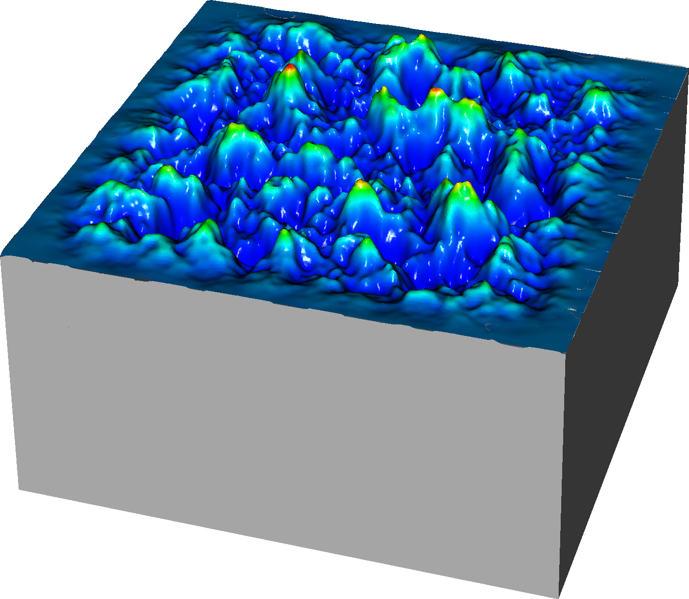

## Examples/StreamerInception/ElectrodeRoughness

This example solves a (stationary) streamer inception problem in SF6 in a "uniform" gap but including surface roughness on the electrode. 
It was set up from $DISCHARGE_HOME/Physics/StreamerInception using

```./setup.py -base_dir=Exec/Examples/StreamerInception -app_name=ElectrodeRoughness -geometry=NoisePlane```

The program uses input data for SF6, computed using BOLSIG+.

In 3D, the program is set up to run in stationary mode, i.e. computing only the inception integral and the critical volume.
The program does not evaluate the possibility of a first electron in the critical volume.
If you want to extend this program with that capability, see Exec/Examples/StreamerInception/Vessel in order to see how you should set the ion density and mobility. 

To compile in 3D:

```make -s -j<num_proc> OPT=HIGH DIM=3 program```

To run it, type

```mpirun -np <num_proc> program3d.*.ex example3d.inputs```

The figure below show the field magnitude and inception regions on the electrode surface:



