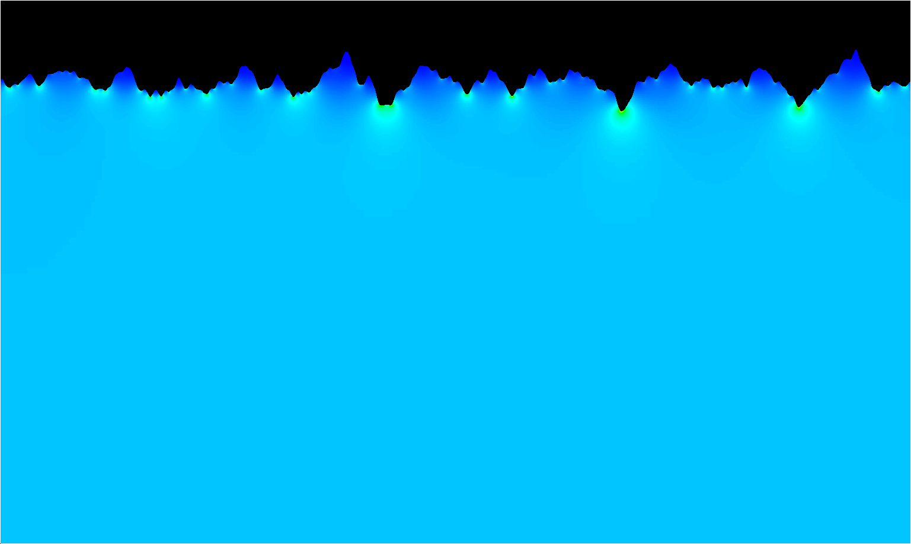
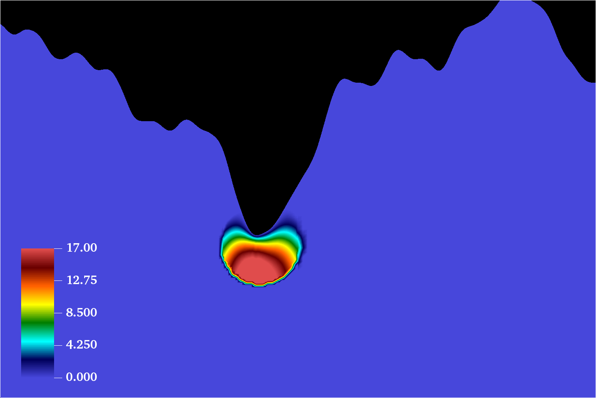

## Exec/Examples/StreamerInception/ElectrodeRoughness

This example runs a streamer inception model for a vessel geometry. 
It was set up from $DISCHARGE_HOME/Physics/StreamerInception using

> ./setup.py -base_dir=Exec/Examples/StreamerInception -app_name=ElectrodeRoughness -geometry=RoughSphere

The effective ionization coefficient for SF6 was computed using BOLSIG+. 

To compile the example: 

```
make -s -j<num_proc> OPT=HIGH DIM=2 program
```

To run it:

```
mpirun -np <num_proc> program2d.*.ex example2d.inputs
```




