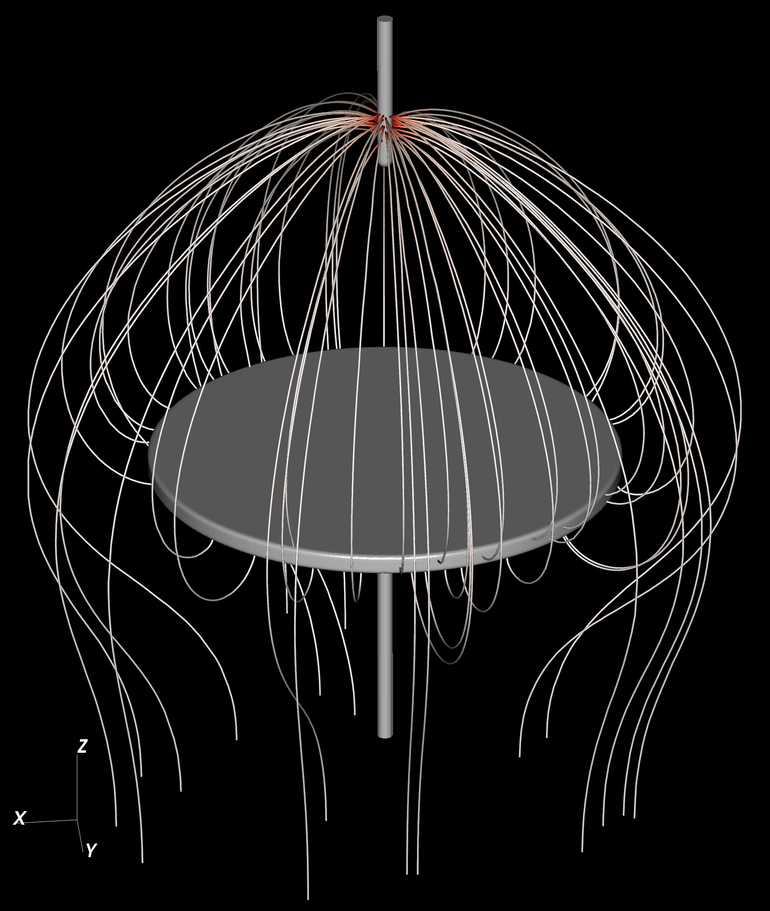
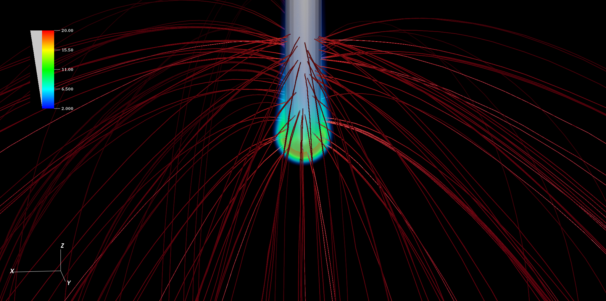

## Exec/Examples/StreamerInception/Vessel

This example runs a streamer inception model for a vessel geometry. 
It was set up from $DISCHARGE_HOME/Physics/StreamerInception using

> ./setup.py -base_dir=Exec/Examples/StreamerInception -app_name=Vessel -geometry=Vessel

The effective ionization coefficient for air was computed using BOLSIG+. 

In 3D, this example will take a few minutes to complete, and should be used with MPI.
To compile it and run it in 2D/3D, type

> make -s -j<num_proc> OPT=HIGH DIM=2 program
> make -s -j<num_proc> OPT=HIGH DIM=3 program

To run it, type

> mpirun -np <num_proc> program2d.*.ex example2d.inputs
> mpirun -np <num_proc> program3d.*.ex example3d.inputs

The figures below show the field distribution and inception region (3D).

