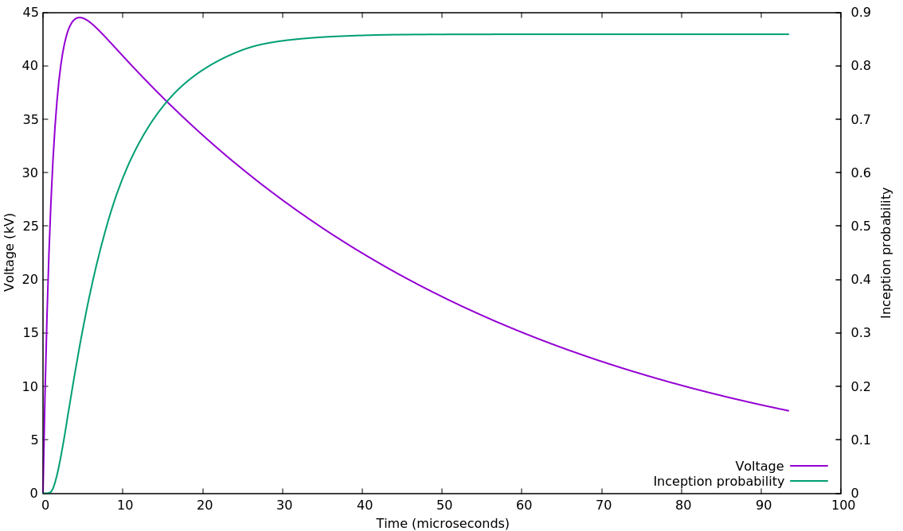
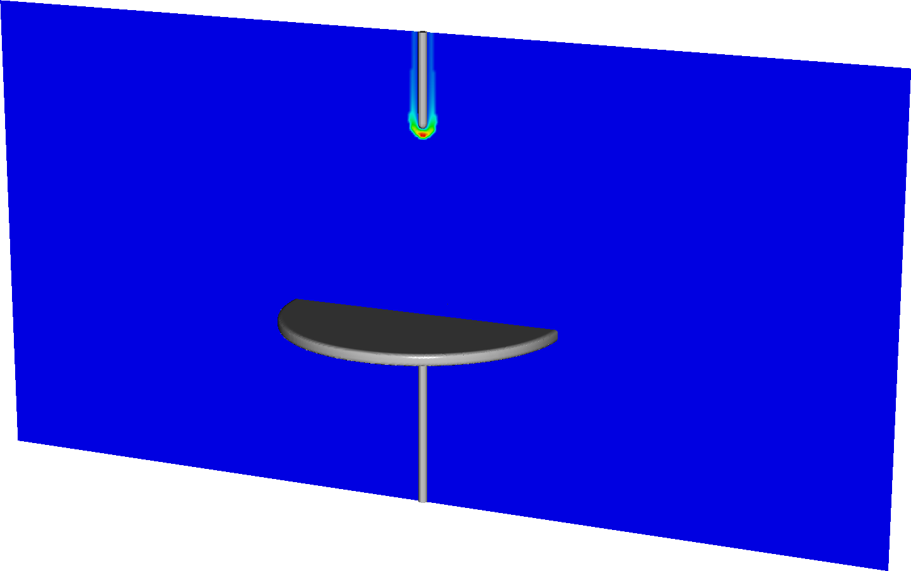

## Examples/StreamerInception/Vessel

This example solves a streamer inception problem for a high voltage vessel geometry. 
It was set up from $DISCHARGE_HOME/Physics/StreamerInception using

```./setup.py -base_dir=Exec/Examples/StreamerInception -app_name=Vessel -geometry=Vessel```

The program uses input data for atmospheric-pressure air, computed using BOLSIG+.


In 2D, the program is set up to run in stationary mode (no transient evolution).
To compile it in 2D:

```make -s -j<num_proc> OPT=HIGH DIM=2 program```

To run it, type

```mpirun -np <num_proc> program2d.*.ex example2d.inputs```

The two figures below show the inception voltage for a starting electron evolving into a critical avalanche at positive and negative polarity.


In 3D, the program is set up to run in transient mode for a lightning impulse.
The program defines the ion mobility and ion distribution for computing the discharge inception probability, and advects the negative ions during the LI.
To compile in 3D:

```make -s -j<num_proc> OPT=HIGH DIM=3 program```

To run it, type

```mpirun -np <num_proc> program3d.*.ex example3d.inputs```

The figure below show the reconstructed K-value (at an arbitrary time step in the simulation).



The next figure below show the instantaneous voltage and the corresponding discharge inception probability (which in this program is due to detachment form negative ions). 

