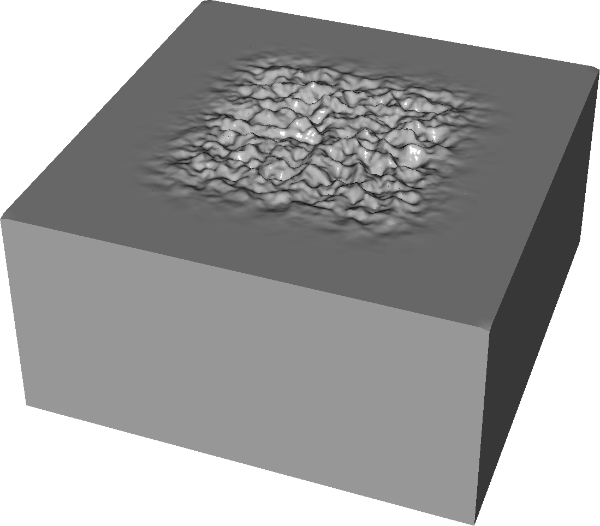
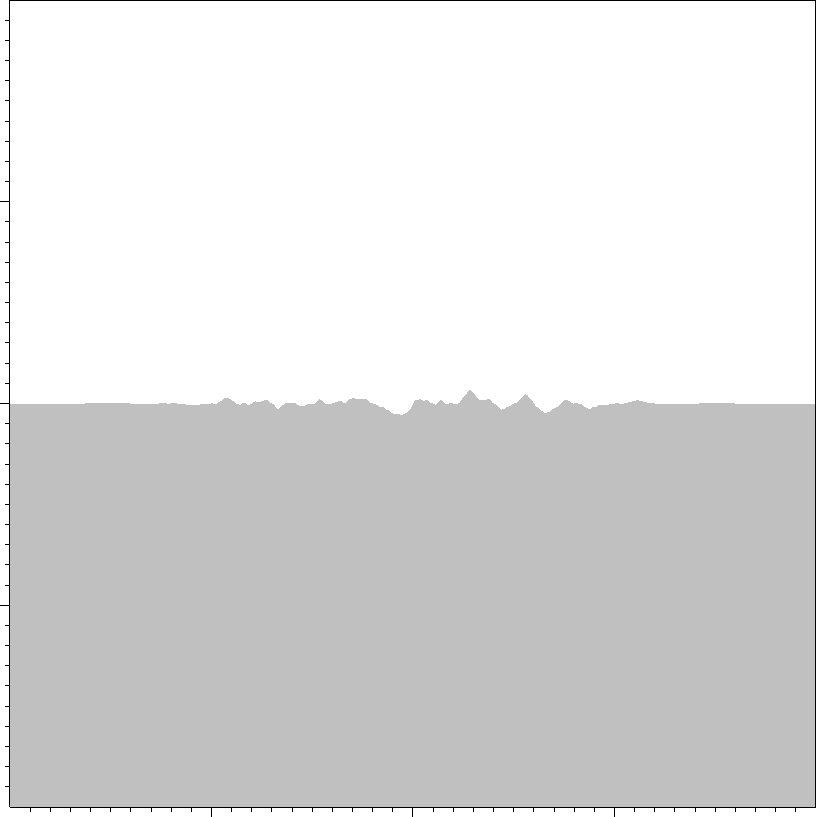

## Geometries/NoisePlane

Noisy plane geometry -- the slab can be either an electrode or a dielectric.
The user will specify the necessary variables for the Perlin noise, and the clamping region which bounds the noise to a Cartesian region in space. 

