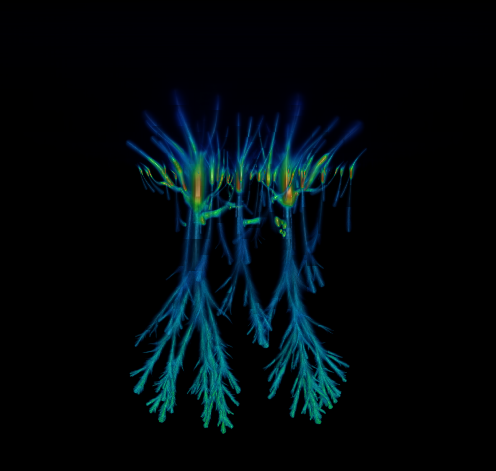

[](https://doi.org/10.21105/joss.05335)
[](https://zenodo.org/badge/latestdoi/355565674)

chombo-discharge
----------------

This is ``chombo-discharge``, a multiphysics code which uses ``Chombo`` for discharge simulations with adaptive mesh refinement (AMR) on embedded boundary grids.
``chombo-discharge`` is aimed at performant electric discharge simulations (e.g., Townsend discharges, streamer discharges, sprites, etc.), and scales to tens of thousands of CPU cores.

``chombo-discharge`` features include:

* Fully written in C++.
* Parallelized with OpenMP, MPI, or MPI+OpenMP.
* Scales to tens of thousands of CPUs.
* Supports complex geometries (electrodes/dielectrics).
* Parallel I/O with HDF5.
* Efficient geometric multigrid solvers.
* Support for dual-grid operations with individual load-balancing of particle and fluid solvers.
* Support for both particle and fluids, including particle-mesh operations (e.g., Particle-In-Cell).

A modified version of ``Chombo`` is distributed together with this code.

<p align="center">
   
   
</p align="center">


Installation
------------

Installation of ``chombo-discharge`` depends on the level of parallelism that is desired (if any). 
The code supports OpenMP, MPI, and MPI+OpenMP types of parallelism.
For complete installation instructions for serial or parallel execution, see https://chombo-discharge.github.io/chombo-discharge/Base/Installation.html. 

Documentation
-------------

User documentation is available as [HTML](https://chombo-discharge.github.io/chombo-discharge/) or as a [PDF](https://github.com/chombo-discharge/chombo-discharge/raw/gh-pages/chombo-discharge.pdf).
A doxygen-generated API is [also available](https://chombo-discharge.github.io/chombo-discharge/doxygen/html/index.html).

License
-------

See LICENSE and Copyright.txt for redistribution rights.


Contributing
------------

We welcome feedback, bug reports, or code contributions.

1. Create a branch for the new feature.

   ```
   git checkout main
   git pull
   git checkout -b my_branch
   ```
   
2. Develop the feature.

   ```
   git add .
   git commit -m "my commit message"
   ```

   If relevant, add Sphinx and doxygen documentation.
   
3. Format the source and example codes using ```clang-format```:

   ```
   find Source Physics Geometries Exec \( -name "*.H" -o -name "*.cpp" \) -exec clang-format -i {} +
   ```
   
4. Push the changes to GitHub

   ```
   git push --set-upstream origin my_branch
   ```
   
5. Create a pull request and make sure the GitHub continuous integration tests pass.
