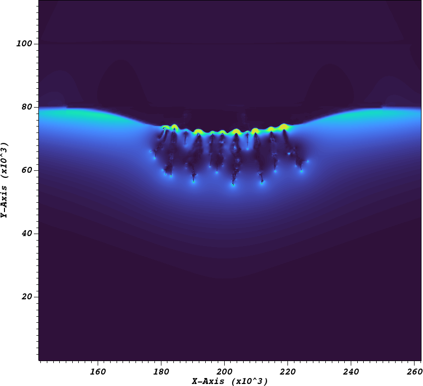

# Summary

chombo-discharge is 2D and 3D adaptive code for simulating low-temperature gas discharges in complex geometries. 
Such discharges occur when electrons accelerate in strong electric fields and ionize the gas, and further evolution is often determined by the space charge set up by electrons and ions. 
Streamers, for example, are filamentary plasma dominated by space charge effects and are precursors to leader, sparks, and lightning.

Gas discharge problems typically involve simulations over multiple scales in time and space.
chombo-discharge reduces the cost of such simulations by using Cartesian Adaptive Mesh Refinement (AMR).
It also provides support for multi-material complex geometries (gas phase, electrodes, and solid dielectrics) through an embedded boundary (EB) formulation.
The code uses a solver-centered modular design where larger applications are constructed by strongly or weakly coupling numerical solvers shipped with the chombo-discharge base code.
Depending on their needs, users can therefore enter the code through several layers:
E.g. they only need to learn pre-existing text interfaces when using existing applications; use solver C++ APIs when typing up new applications, or use the EB AMR infrastructure when writing entirely new solvers.

Several solvers exist in chombo-discharge, all of which are parallelized and compatible with EBs and AMR:

* Advection-diffusion-reaction solvers.
* Helmholtz equation solvers, using geometric multigrid. 
* Electrostatic solvers (with support for discontinuous coefficients).
* Kinetic Monte Carlo solvers. 
* Radiative transfer solvers. 
* Various particle solvers, e.g. for Monte Carlo radiative transfer, tracer particles, Brownian walkers, or kinetic Particle-In-Cell.
* Volumetric and cut-cell ODE solvers.

All solvers exist as stand-alone applications, but many of these solvers are also coupled through more complex physics applications that aim at resolving different types of discharge phenomena (e.g. statistical inception models or streamer discharges).
The interaction of these solvers occurs through a common AMR core, which can also use dual grids where e.g. fluid and particle kernels are load-balanced separately.
chombo-discharge uses the Chombo infrastructure for the AMR and EB infrastructure, and is parallelized using MPI.
However, chombo-discharge supplies its own solver discretizations. 

# Statement of need

There is already a number of discharge simulation codes currently available.
Commerical codes used for simulating discharge include COMSOL, ANSYS Fluent, OpenFOAM, PLASIMO, VSIM/VPIC, and Vizglow.
Many non-commerical codes also exist, such as Afivo-streamer [@Teunissen:2017], which also uses Cartesian AMR.

While chombo-discharge is not the only open-source discharge simulation code, it has a number of unique features.
In particular, chombo-discharge supports complex geometries and is therefore useful for lightning initiation investigations (from hydrometeors), in high-voltage technology, plasma medicine and plasma-assisted combustion. 
The code is also quite performant, and its design pattern permits a flexible and extensible approach to numerically solving various discharge problems, even when these require many thousands of CPU cores.
For example, coupling a drift-diffusion Particle-In-Cell model together with an electrostatics and Monte Carlo based radiative transfer solvers required about 3500 lines of C++ code, and this includes the work for dual-grid load-balancing up to at least 8000 CPU cores, and all integration and I/O functionality. 

# Application examples

Originally, the code was written for studying pre-breakdown phenomena in high-voltage equipment [@Marskar:2019], but over time it has been adapted to fit a wider category of discharge problems.

* Studying upper atmospheric lightning (sprite discharges).

  

* Simulation of laboratory-scale using non-kinetic Particle-In-Cell. 

  

* Surface discharge evolution over complex surfaces. 

  

# Acknowledgements

# References